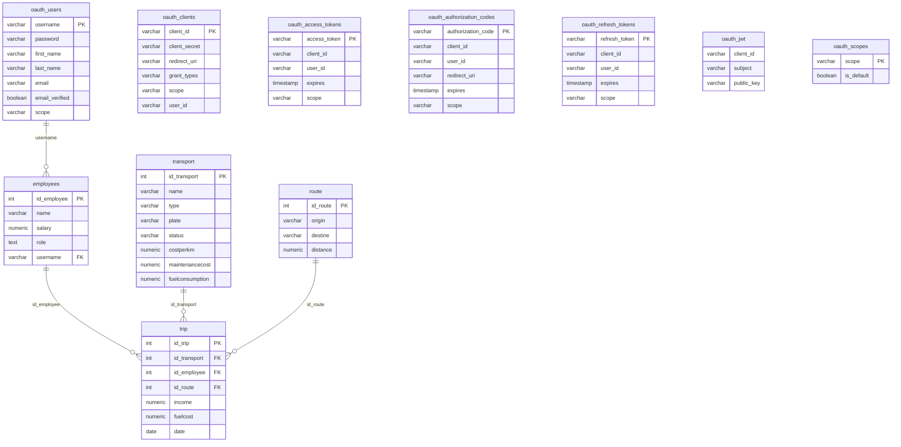

# Proyecto_SGT por Angular
## Sistema de Gestión de Transportes (SGT) - Módulo de Control Administrativo

Aplicación web full-stack para la gestión administrativa de transportes, desarrollada como proyecto final para la asignatura Desarrollo Web de API y SPA, Universidad Autónoma De Yucatán.

El sistema permite a administradores gestionar empleados, vehículos y viajes a través de una interfaz SPA, y a conductores consultar los viajes que tienen asignados. Incluye autenticación OAuth2 con roles diferenciados, generación de códigos QR por viaje, exportación de reportes en PDF y Excel, y un dashboard logístico con gráficas.

## Equipo de desarrollo

| Nombre                           |
|----------------------------------|
| Cabrera Vidaña Arturo            |
| Salazar Gael                     |
| Pérez Saldívar Iván Augusto      |
| Rodríguez Jaime Julián Alejandro |

### Base de datos
| Tecnología | Detalle |
|---|---|
| PostgreSQL | Hosteado en Supabase |

---

## Ficha Técnica

### Frontend
| Tecnología / Paquete        | Versión           | Rol                                                                   |
|-----------------------------|-------------------|-----------------------------------------------------------------------|
| Angular                     | 21.1.0            | Framework SPA — View + Controller (componentes y servicios)           |
| TypeScript                  | ~5.9.2            | Tipado estático — interfaces de dominio (Modelo)                      |
| HTML / CSS                  | —                 | Maquetación y estilos de los componentes                              |
| `@angular/router`           | 21.1.0            | Dispatch de vistas por URL; lazy loading; metadatos de rol            |
| `@angular/common/http`      | 21.1.0            | Capa HTTP — comunicación con la API REST                              |
| `ReactiveFormsModule`       | 21.1.0            | Formularios con validación declarativa (`Validators`)                 |
| `HttpInterceptorFn`         | 21.1.0            | Inyección automática de `Authorization: Bearer` en cada petición      |
| `CanActivateFn` (authGuard) | 21.1.0            | Protección de rutas; verifica existencia y expiración del token       |
| `BehaviorSubject` (RxJS)    | 7.x               | Estado reactivo del catálogo; notifica a las vistas automáticamente   |
| Chart.js + ng2-charts       | ^4.5.1 + ^10.0.0  | Gráficas interactivas en el dashboard                                 |
| `jspdf`                     | ^4.2.1            | Motor de generación de PDF en el cliente                              |
| `jspdf-autotable`           | ^5.0.7            | Plugin de tabla para jsPDF (encabezados, filas alternas, estilos)     |
| `xlsx` (SheetJS)            | ^0.18.5           | Generación de libros `.xlsx` con ajuste automático de columnas        |
| `qrcode`                    | ^1.5.4            | Generación de códigos QR en formato Data URL (PNG base64)             |
| `@types/qrcode`             | ^1.5.6            | Definiciones de tipos TypeScript para `qrcode`                        |

### Backend
| Tecnología / Paquete     | Versión   | Rol                                                               |
|--------------------------|-----------|-------------------------------------------------------------------|
| PHP                      | ~8.0–8.2  | Lenguaje del backend                                              |
| Laminas API Tools        | ^1.7      | Framework MVC del servidor — routing, controllers, vistas JSON    |
| Laminas API Tools OAuth2 | ^1.9      | Servidor OAuth2 (Password Grant); genera y almacena access tokens |
| Laminas MVC Auth         | incluida  | Mapeo módulo → adaptador de autenticación; reglas de autorización |
| PostgreSQL (Supabase)    | —         | Persistencia de datos; tablas de negocio y OAuth2                 |

---

## Requisitos previos

### Frontend
- **Node.js** >= 20 y **npm** >= 10.9.3
- **Angular CLI** >= 21.2 — instalación global: `npm install -g @angular/cli@21`

### Backend
- **PHP** 8.0, 8.1 o 8.2 con extensiones: `pdo`, `pdo_pgsql`, `mbstring`, `json`, `openssl`
- **Composer** >= 2.x (gestor de paquetes PHP)

---

## Instrucciones de instalación

### 1. Configurar el backend

```bash
cd backend/sgt-backend
composer install
composer development-enable
```

La conexión a la base de datos en Supabase ya está preconfigurada en `config/autoload/local.php` y `config/autoload/oauth2.local.php`; no es necesario modificar ningún archivo.

```bash
composer serve
```

La API quedará disponible en `http://localhost:8080`.

### 2. Configurar el frontend

```bash
cd "Front V3/Front V3"
npm install
npm start
```

La aplicación Angular quedará disponible en `http://localhost:4200`.

### Credenciales de prueba

Una vez que ambos servidores estén en ejecución, accede a `http://localhost:4200` e inicia sesión con alguna de las siguientes cuentas:

| Rol            | Usuario        | Contraseña  |
|----------------|----------------|-------------|
| Administrador  | `julian_Admin` | `12345`     |
| Conductor      | `m.salas`      | `driver123` |

---

## Estructura de carpetas

```
Proyecto_SGT-por-Angular/
├── Front V3/
│   └── Front V3/                        # Aplicación Angular
│       ├── src/
│       │   └── app/
│       │       ├── core/                # Lógica central reutilizable
│       │       │   ├── guards/          # auth.guard.ts — protección de rutas
│       │       │   ├── interceptors/    # auth.interceptor.ts — adjunta el token JWT
│       │       │   └── services/        # auth, nav, qr, report services
│       │       └── features/            # Módulos funcionales por dominio
│       │           ├── auth/            # Login (flujo OAuth2)
│       │           ├── dashboard/       # Página principal con métricas
│       │           ├── employes/        # CRUD de empleados
│       │           │   ├── components/  # employee-form
│       │           │   ├── models/      # employee.ts
│       │           │   ├── pages/       # employes-list, employee-detail
│       │           │   └── services/    # employes.ts
│       │           ├── transport/       # CRUD de vehículos
│       │           │   ├── components/  # transport-form
│       │           │   ├── models/      # transport.ts
│       │           │   ├── pages/       # transport-list, transport-detail
│       │           │   └── services/    # transport.ts
│       │           ├── trips/           # CRUD de viajes
│       │           │   ├── components/  # trips-form
│       │           │   ├── models/      # trips.ts
│       │           │   ├── pages/       # trips-list, trips-detail
│       │           │   └── services/    # trips.ts
│       │           └── logistics/       # Dashboard logístico
│       │               ├── models/      # logistics.ts
│       │               ├── pages/       # logistics-dashboard
│       │               └── services/    # logistics.ts
│       ├── angular.json
│       ├── package.json
│       └── tsconfig.json
│
└── backend/
    └── sgt-backend/                     # API REST con Laminas API Tools
        ├── config/
        │   └── autoload/                # Configuración de DB, OAuth2, CORS
        ├── module/
        │   ├── Application/             # Módulo base de Laminas MVC
        │   └── employees/               # Módulo principal del negocio
        │       └── src/V1/
        │           ├── Rest/
        │           │   ├── Employees/   # Recurso REST de empleados
        │           │   ├── Transport/   # Recurso REST de transporte
        │           │   └── Trips/       # Recurso REST de viajes
        │           └── Rpc/
        │               ├── Register/    # Endpoint de registro de usuarios
        │               └── Logistics/   # Endpoint de reportes logísticos
        ├── public/
        │   └── index.php                # Punto de entrada del backend
        └── vendor/                      # Dependencias PHP (Composer)
```
---

## Especificación 1 — Aplicación web con esquema MVC

El proyecto implementa el patrón MVC en dos capas que se complementan:

- **Backend (Laminas API Tools / PHP):** sigue MVC de forma estricta. Los controladores extienden `AbstractActionController` de Laminas MVC, las entidades y colecciones representan la capa de Modelo, y la capa de Vista se materializa como respuestas JSON/HAL negociadas automáticamente por Laminas Content Negotiation.
- **Frontend (Angular SPA):** aplica una variante moderna del patrón. Las interfaces TypeScript son el Modelo; los servicios inyectables (`@Injectable`) actúan como capa de Control (lógica de negocio, acceso a datos vía HTTP); y los componentes standalone con sus plantillas HTML son la Vista. El Router de Angular dirige cada URL a su componente correspondiente, equivalente al dispatch del controlador.

Ambas capas se comunican exclusivamente a través de la API REST del backend; el frontend nunca accede directamente a la base de datos.

### Flujo de uso

1. El usuario abre la aplicación; Angular Router evalúa la URL y redirige a `/app/login` si no hay token válido.
2. El usuario introduce credenciales; `AuthService.login()` envía `POST /oauth` al backend Laminas.
3. El backend valida las credenciales contra `oauth_users` en Supabase y devuelve un token OAuth2.
4. `AuthService` guarda el token en `localStorage`; el `authInterceptor` lo incluirá en todas las peticiones posteriores.
5. Angular Router dirige al usuario al layout correspondiente (`AdminLayout` o `DriverLayout`) según el rol codificado en el token.
6. Al navegar a `/app/admin/employee`, el Router hace lazy load de `EmployeeListComponent` (Vista).
7. `EmployeeListComponent` inyecta `EmployeeService` (Control) y se suscribe a `data$`.
8. El servicio solicita los datos a `GET /employees`; el backend Laminas despacha la petición al `EmployeesResourceController`, consulta la base de datos y devuelve la colección como HAL+JSON.
9. El servicio actualiza el `BehaviorSubject`; el componente Vista recibe el array y lo pasa al `<app-table>` genérico para su renderizado.
10. El usuario puede crear, editar o eliminar registros; cada acción fluye Vista → Servicio (Control) → API REST → Modelo (BD), manteniendo la separación de responsabilidades del patrón MVC.

---

## Especificación 2 — Autenticación y Autorización (JWT y OAuth)

El sistema implementa el flujo **OAuth2 Password Grant** respaldado por Laminas API Tools OAuth2. El backend actúa simultáneamente como servidor de autorización y servidor de recursos:

- Al autenticarse, el cliente Angular envía las credenciales al endpoint `/oauth` del backend mediante `application/x-www-form-urlencoded` con `grant_type=password`. Laminas valida el usuario contra la tabla `oauth_users` en Supabase, genera un `access_token` (JWT) y lo persiste en `oauth_access_tokens`.
- El token es un **JWT** con tres segmentos (header · payload · signature); el frontend decodifica el payload con `atob()` para extraer metadatos como `employeeId` y `exp` (expiración).
- El frontend guarda el token en `localStorage` y lo adjunta automáticamente en cada petición HTTP posterior mediante el `authInterceptor` funcional, que inyecta el encabezado `Authorization: Bearer <token>`.
- Las rutas protegidas (`/app/admin/*`, `/app/driver/*`) están resguardadas por `authGuard`, que comprueba la existencia del token y su expiración antes de permitir la navegación.
- El rol del usuario (`ADMIN` / `DRIVER`) se determina consultando `GET /employees?username=<user>` con el token recién obtenido y se persiste en `localStorage` para el enrutamiento inicial.
- En el backend, `global.php` mapea el módulo `employees\V1` al adaptador `oauth2postgres`, lo que fuerza la validación del Bearer token en todos los endpoints del módulo.

### Flujo de uso

1. El usuario abre la aplicación; `StartRoutingComponent` comprueba `localStorage` — si no hay token, redirige a `/app/login`.
2. El usuario introduce usuario y contraseña en el formulario reactivo de `LoginComponent`.
3. `AuthService.login()` compone un `POST /oauth` con `grant_type=password` y `client_id=angular_app`, codificado como `application/x-www-form-urlencoded`.
4. Laminas OAuth2 valida las credenciales contra la tabla `oauth_users` en Supabase y devuelve un JWT con `access_token`, `expires_in` y `token_type: Bearer`.
5. `AuthService.saveToken()` persiste el token en `localStorage`; acto seguido se llama a `GET /employees?username=<user>` con el token para recuperar el rol.
6. `LoginComponent` guarda el rol en `localStorage` y navega a `/app/admin/dashboard` (rol `ADMIN`) o `/app/driver/dashboard` (rol `DRIVER`).
7. `authGuard` intercepta la navegación: decodifica el payload JWT con `atob()`, compara `payload.exp` con `Date.now() / 1000`; si el token expiró, hace logout y redirige al login.
8. En cada petición HTTP posterior, `authInterceptor` clona el `HttpRequest` y añade `Authorization: Bearer <token>` automáticamente.
9. El backend valida el Bearer token en cada llamada a `employees\V1` antes de ejecutar el controlador, usando el adaptador `oauth2postgres`.
10. Al cerrar sesión, `AuthService.logout()` elimina `access_token` y `refresh_token` de `localStorage`; el guard redirige al login en el siguiente intento de navegación.

---

## Especificación 3 — Generación de Códigos QR

El sistema genera un código QR único por cada viaje registrado. El QR codifica la URL del endpoint REST del backend correspondiente al viaje (`http://localhost:8080/trips/{id_trip}`), de modo que al escanearlo se accede directamente al recurso del viaje a través de la API.

### Flujo de uso

1. El usuario navega a **Viajes** (`/trips`).
2. En la tabla, cada fila tiene el botón **QR**.
3. Al pulsarlo, `TableComponent` emite el evento `qr` con los datos del viaje.
4. `TripsListComponent` recibe el evento, guarda el viaje seleccionado y activa `showQrModal = true`.
5. Se renderiza `<app-qr-modal>`, que en su `ngOnInit` llama a `QrService.generateTripQr(id_trip)`.
6. `QrService` importa dinámicamente `qrcode`, construye la URL `http://localhost:8080/trips/{id}` y devuelve el Data URL del QR.
7. El modal muestra el QR como imagen y ofrece descargarlo como PNG.
8. En la vista de detalle del viaje, el QR se genera automáticamente al cargar la página.

---

## Especificación 4 — CRUD: Catálogos y Formularios

El sistema implementa operaciones CRUD completas (Crear, Leer, Actualizar, Eliminar) sobre tres entidades de dominio: **Empleados**, **Transportes** y **Viajes**. Cada entidad sigue el mismo patrón arquitectónico:

- **Modelo TypeScript** — interface que define la forma del objeto.
- **Servicio `@Injectable`** — gestiona el estado reactivo con `BehaviorSubject` y expone los métodos `getAll()`, `getById()`, `create()`, `update()` y `delete()`.
- **Componente de lista** — muestra los registros en el `TableComponent` genérico con búsqueda y filtros. Delega las acciones de Ver, Editar y Eliminar al router o al servicio.
- **Componente de detalle/formulario** — determina su modo (nuevo / vista / edición) a partir de los segmentos de la URL (`new`, `:id`, `:id/edit`) y renderiza el formulario reactivo con validaciones.
- **Rutas con lazy loading** — cada módulo de feature define su propio `Routes[]` cargado mediante `loadComponent()`, lo que minimiza el bundle inicial.

En el backend, el módulo `employees` expone el endpoint REST `/employees[/:employees_id]` configurado en Laminas API Tools con soporte para GET, POST, PUT, PATCH y DELETE sobre la tabla `employees` en Supabase. El endpoint RPC `POST /register` crea simultáneamente el usuario OAuth2 y el registro de empleado.

### Flujo de uso

1. El usuario autenticado navega a `/app/admin/employee` (o `transport` / `trips`); Angular hace lazy load del `ListComponent` correspondiente.
2. El `ListComponent` se suscribe a `service.data$` en `ngOnInit()` y el `TableComponent` genérico renderiza la tabla con los registros actuales.
3. El usuario escribe en el campo de búsqueda; el getter `filtered` recalcula el array en tiempo real sin peticiones adicionales.
4. Al pulsar **Nuevo**, el router navega a `/<entidad>/new`; `DetailComponent` detecta el segmento `new` y activa `isEdit = true`.
5. El `FormComponent` construye el formulario vacío con `fb.group()`; el usuario completa los campos validados y pulsa Guardar.
6. `submit()` llama a `service.create()`, que asigna un ID temporal, empuja el objeto al array y llama a `refresh()` — el `BehaviorSubject` emite el nuevo array a todos los suscriptores.
7. El router vuelve a la lista, que recibe el nuevo registro automáticamente por la suscripción reactiva.
8. Al pulsar **Editar** en una fila, el router navega a `/<entidad>/:id/edit`; `DetailComponent` carga el registro con `service.getById(id)` y el formulario lo precarga con `patchValue()`.
9. Al guardar, `service.update()` reemplaza el objeto en el array y `refresh()` propaga el cambio a la vista.
10. Al pulsar **Eliminar**, `service.delete()` filtra el array y el `BehaviorSubject` notifica la lista, que actualiza la tabla sin recarga de página.

---

## Especificación 5 — Reportes en formato PDF y hoja de cálculo

El sistema genera reportes descargables en dos formatos desde las vistas de lista de **Empleados** y **Viajes**:

- **PDF** — producido con `jsPDF` + `jspdf-autotable`. El documento se genera en orientación horizontal, incluye título, fecha/hora de generación en español (locale `es-MX`) y una tabla con encabezado oscuro, filas alternas en gris claro y formato de moneda automático (MXN) para columnas que contengan `cost`, `income`, `salary` o `fuelcost` en su nombre de campo.
- **Excel (.xlsx)** — producido con SheetJS (`xlsx`). Se construye un libro con una hoja llamada `Datos`, las columnas llevan los encabezados legibles (no los nombres de campo internos) y el ancho de cada columna se ajusta automáticamente al mayor entre la longitud del encabezado y 15 caracteres.

Ambos formatos exportan exclusivamente los **datos ya filtrados** por la búsqueda activa, de modo que el usuario puede exportar subconjuntos específicos sin manipulación adicional. Los archivos se nombran con un sufijo de timestamp `YYYYMMdd_HHmm` para evitar colisiones de nombres.

Las tres librerías se cargan con **importación dinámica** (`await import(...)`) para excluirlas del bundle inicial de la aplicación; sólo se descargan cuando el usuario activa la exportación.

Toda la lógica de generación se centraliza en un único `ReportService` inyectable, reutilizado por `EmployeeListComponent` y `TripsListComponent`.

### Flujo de uso

1. El usuario navega a la lista de **Empleados** o **Viajes** y, opcionalmente, escribe en el buscador para filtrar los registros.
2. Pulsa el botón **📄 PDF** o **📊 Excel** de la barra de filtros.
3. El componente llama a `reportService.exportToPdf(this.filtered, ...)` o `exportToExcel(this.filtered, ...)`, pasando sólo los registros visibles tras el filtro.
4. `ReportService` ejecuta `await import('jspdf')` / `await import('xlsx')` — la librería se descarga bajo demanda si aún no está en caché del navegador.
5. **Para PDF:** `jsPDF` crea un documento horizontal; el título y la fecha se escriben en el encabezado; `autoTable` construye la tabla con estilos, detecta campos numéricos de tipo monetario y los formatea como `$X,XXX.XX MXN`.
6. **Para Excel:** SheetJS convierte el array de objetos a una hoja usando `col.label` como encabezado de columna; ajusta los anchos y escribe el archivo con `XLSX.writeFile`.
7. El navegador descarga el archivo automáticamente con el nombre `reporte_de_empleados_YYYYMMdd_HHmm.pdf` (o `.xlsx`) sin necesidad de servidor.

---

## Especificación 6 — Administración de usuarios y permisos

El sistema implementa un esquema de **dos roles** (`ADMIN` y `DRIVER`) que controlan tanto el acceso a las rutas de la SPA como la visibilidad de los datos:

- **Creación de usuarios** — el endpoint RPC `POST /register` del backend crea simultáneamente un registro en `oauth_users` (credenciales OAuth2 con contraseña hasheada en bcrypt) y un registro en `employees` (datos del empleado con su rol). Solo el administrador, a través de la interfaz, opera este endpoint.
- **Autenticación y asignación de rol** — tras el login OAuth2, `LoginComponent` consulta `GET /employees?username=<user>` para recuperar el campo `role` del empleado y lo persiste en `localStorage`. En cada arranque de la app, `StartPageComponent` lee ese valor para enrutar al layout correcto.
- **Layouts diferenciados por rol** — `AdminLayout` expone navegación a Dashboard, Empleados, Transportes, Viajes y Logística; `DriverLayout` sólo expone Dashboard y Viajes propios. Cada layout vive en su árbol de rutas independiente (`/app/admin/**` y `/app/driver/**`).
- **Protección de rutas** — `authGuard` intercepta la navegación hacia ambos layouts y verifica que exista un token válido y no expirado. Cualquier intento de acceso sin token redirige automáticamente a `/app/login`.
- **Filtrado de datos por rol** — `TripsListComponent` detecta el rol del árbol de rutas activo (`route.pathFromRoot`) y, cuando es `driver`, filtra la lista de viajes para mostrar únicamente los asignados al empleado autenticado (cuyo `id` se extrae del payload JWT).
- **Reglas de autorización en el backend** — `module.config.php` del módulo `employees` declara explícitamente qué verbos HTTP requieren autenticación en la colección y en la entidad. El mapeo en `global.php` garantiza que el adaptador `oauth2postgres` valide el Bearer token antes de despachar cualquier petición al módulo.

### Flujo de uso

1. El **administrador** accede a la app; `StartPageComponent` detecta `role = 'ADMIN'` en `localStorage` y redirige a `/app/admin/dashboard`.
2. El `AdminLayout` renderiza la barra de navegación completa: Dashboard, Empleados, Transportes, Viajes y Logística.
3. Para registrar un nuevo usuario, el administrador navega al formulario de alta de empleado y envía los datos; el frontend llama a `POST /register` con `name`, `username`, `password`, `salary` y `role` (`ADMIN` o `DRIVER`).
4. `RegisterController` hashea la contraseña con bcrypt, inserta en `oauth_users` y en `employees`, y devuelve `{ registered: true }`.
5. El **conductor** accede a la app con sus propias credenciales; `LoginComponent` hace `POST /oauth`, obtiene el token y llama a `GET /employees?username=<user>` para leer su `role`.
6. `LoginComponent` persiste `role = 'driver'` en `localStorage` y navega a `/driver` (alias con `skipLocationChange`); `StartPageComponent` mapea eso a `/app/driver/dashboard`.
7. El `DriverLayout` muestra sólo Dashboard y Viajes; las rutas `/app/admin/**` no están en el árbol del driver y son inaccesibles.
8. En la vista de Viajes del driver, `TripsListComponent` lee `data['role'] = 'driver'` desde el árbol de rutas y filtra la lista para mostrar únicamente los viajes donde `id_employee === authService.getEmployeeId()`.
9. Al navegar directamente a una URL protegida sin token (o con token expirado), `authGuard` llama a `auth.logout()` y redirige a `/app/login`, impidiendo el acceso a cualquier layout protegido.
10. Al cerrar sesión, `AuthService.logout()` elimina `access_token` y `refresh_token` de `localStorage`; en el siguiente ciclo de navegación, `authGuard` detecta la ausencia del token y redirige al login.

---

## Endpoints del API

Base URL: `http://localhost:8080`

Todos los endpoints (excepto `/register`) requieren el header:
```
Authorization: Bearer <token>
```

### Autenticación

| Método | Endpoint | Descripción |
|---|---|---|
| `POST` | `/oauth` | Obtener token de acceso (OAuth2) |
| `POST` | `/register` | Registrar nuevo usuario |

### Empleados

| Método | Endpoint | Descripción |
|---|---|---|
| `GET` | `/employees` | Listar todos los empleados |
| `GET` | `/employees/:employee_id` | Obtener un empleado por ID |
| `POST` | `/employees` | Crear un nuevo empleado |
| `PUT` | `/employees/:employee_id` | Actualizar un empleado |
| `DELETE` | `/employees/:employee_id` | Eliminar un empleado |

### Transporte

| Método | Endpoint | Descripción |
|---|---|---|
| `GET` | `/transport` | Listar todos los vehículos |
| `GET` | `/transport/:transport_id` | Obtener un vehículo por ID |
| `POST` | `/transport` | Registrar un nuevo vehículo |
| `PUT` | `/transport/:transport_id` | Actualizar un vehículo |
| `DELETE` | `/transport/:transport_id` | Eliminar un vehículo |

### Viajes

| Método | Endpoint | Descripción |
|---|---|---|
| `GET` | `/trips` | Listar todos los viajes |
| `GET` | `/trips/:id_trip` | Obtener un viaje por ID |
| `POST` | `/trips` | Registrar un nuevo viaje |
| `PUT` | `/trips/:id_trip` | Actualizar un viaje |
| `DELETE` | `/trips/:id_trip` | Eliminar un viaje |

### Logística

| Método | Endpoint | Descripción |
|---|---|---|
| `GET` | `/logistics` | Obtener datos del dashboard logístico |

---

## Diagrama de base de datos alojada en Supabase


---

